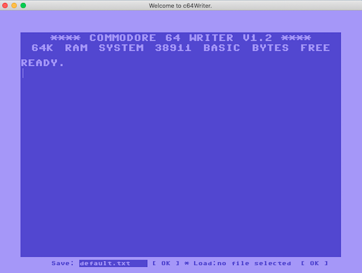

# c64Writer 


Taking inspiration from zen text-editors like [Ommwriter](https://ommwriter.com/), **c64Writer** is a bare-bones cross-platform text-processor  created to look like the famous Commodore 64 BASIC environment. 
The editor is kept very simple on purpose to help the writer focus on what matters most: words.

### Features
* Commodore 64 system-wide colours and fonts
* Full screen mode
* Copy/paste, save/load functionality

### Installation and Updating
1. Create a folder for the application (eg. `~/c64Writer`).
2. Install all required dependencies.

       python3 -m pip install -r requirements.txt

3. Run in a terminal:

       cd ~/c64Writer
       git clone https://github.com/c64-dev/c64Writer.git --branch master

### Update
In order to update the application, open a terminal and run:

    cd ~/c64Writer
    git pull

## Usage
Go to the application's folder and run:

```
python3 c64Writer.py
```

or if you are in Windows enter:

```
c:\python<PYTHON_VERSION_HERE>\python.exe c64Writer.py
```
